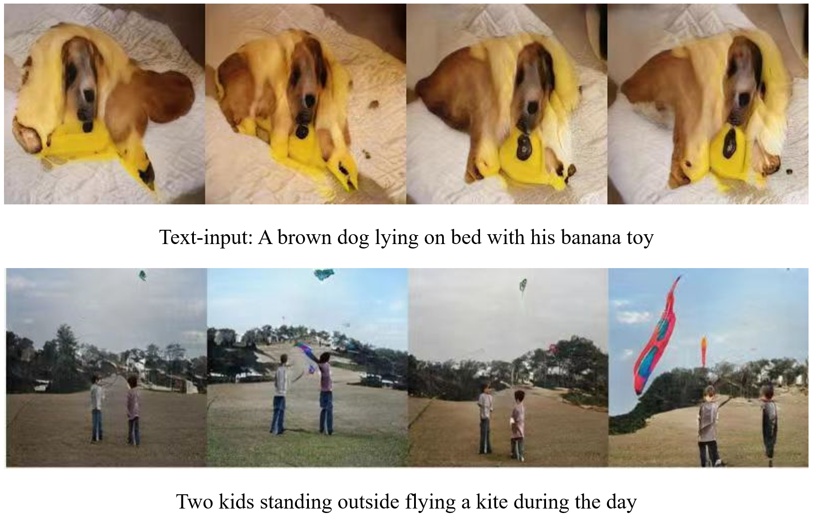

# Obj-SA-GAN
## Obj-SA-GAN - PyTorch Implementation

### Dependencies
python 3.6

Pytorch 0.4.1

In addition, please add the project folder to PYTHONPATH and `pip install` the following packages:
- `python-dateutil`
- `easydict`
- `pandas`
- `torchfile`
- `nltk`
- `scikit-image`
- `spacy`
- `PyYAML`
- `cffi`
- `torchtext`
- `dill`
- `Cython`

====================== DATASET AND PRE-MODELS are consistent with Obj-GAN ======================

**Data**

1. Download our preprocessed metadata for [coco](https://drive.google.com/open?id=1GbZESaDwkpV8gH2gyo1bUogPtYu1QEPF) and merge them to `data/coco`
2. Download [coco](http://cocodataset.org/#download) dataset, extract the images to `data/coco/images`, and extract the annotations to `data/coco/insanns`

**Training**

- Train box generator:
  - `cd box_generation`
  - `python sample.py --is_training 1`
- Train shape generator:
  - `cd shape_generation`
  - `./make.sh`
  - `python main.py --gpu '0,1' --FLAG`
- Train image generator:
  - `cd image_generation`
  - `./make.sh`
  - `python main.py --gpu '0,1' --FLAG`

**Pretrained Model**

Download and save them to `data/coco/pretrained/`
- [DAMSM for coco](https://drive.google.com/open?id=1zIrXCE9F6yfbEJIbNP5-YrEe2pZcPSGJ)
- [Inception v3](https://download.pytorch.org/models/inception_v3_google-1a9a5a14.pth)
- [VGG19 BN](https://download.pytorch.org/models/vgg19_bn-c79401a0.pth)
- [Box generator](https://drive.google.com/file/d/1OTZDywt1UGzUykAXBXmvVA6aAlQzbMjv/view?usp=sharing)
- [Shape generator](https://drive.google.com/file/d/1vyfXxh4eC1ccs9XNhC8OIylErhwLdvmN/view?usp=sharing)
- [Image generator](https://drive.google.com/file/d/1BWXJT5Wg0x0Ajatgb2VdSQG14ndG8CGM/view?usp=sharing)

Note that we have made some modifications (changing the obj attention estimation from "dot product between Glove embeddings" to "cosine similarity between Glove embeddings") based on the code for CVPR submission, and trained 120 epochs using batch size 16. Compared to the results in the paper, the updated results are better on FID and R-prsn scores, and worse on Inception score (because we do not get a chance to train the model using larger batch size).

| Methods  | Box generator | Shape generator |Inception | FID |
| ------------- |  ------------- | ------------- | ------------- | ------------- |
| Obj-GAN | YES | YES | 32.26 | 18.25 |
| Obj-GAN_1 | YSE | NO  | 31.41 | 19.21 |
| Obj-GAN_2 | NO  | YES | 32.54 | 19.87 |

Tips for optimizing the Inception score (though it is boring):
- Increase the batch size as large as possible via distributed training
- Increase the weight for the DAMSM loss

**Sampling**

- Run box generator:
  - `cd box_generation`
  - `python sample.py --is_training 0 --load_checkpoint [replace with your ckpt path]`
- Run shape generator:
  - `cd shape_generation`
  - `python main.py --gpu '0,1' --NET_G [replace with your ckpt path]`
- Run image generator:
  - `cd image_generation`
  - `python main.py --gpu '0,1' --NET_G [replace with your ckpt path]`

**More Results**

